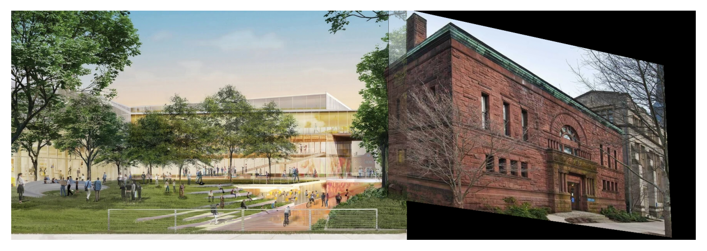

# Hillhouse

This repository contains code for Reimagining Hillhouse. This work was completed as part of CPSC 480: Introduction to Computer Vision.

## Abstract

> Hillhouse Avenue is home to the Department of Applied Science and Engineering at Yale. Attached to the university's recent announcement to rebuild lower Hillhouse Avenue, the school provided a digital rendering of their flagship building (a center for engineering). Our project aims to contribute to this image in two-fold: (1) add more context to the new campus by connecting neighboring buildings, and (2) transform the image into a more realistic style. To achieve these two goals, our project explores two different methods of image stitching, followed by implementing stable diffusion model for the purpose of image stylization.

## Quickstart

This project was developed and tested on an Ubuntu 20.04.5 LTS server with NVIDIA RTX 3090 GPUs on CUDA 11.7, using Python 3.8.17.

1. Clone this repository.

```
$ git clone https://github.com/jaketae/hillhouse.git
```

2. Create a Python virtual environment and install package requirements. Depending on the local platform, you may have to adjust package versions (e.g., PyTorch) as appropriate.

```
$ cd hillhouse
$ python -m venv venv
$ pip install -U pip wheel # update pip
$ pip install -r requirements.txt
```

3. Perform image stitching on the image of Hillhouse and the music building.

```
$ python homography.py
```

4. Run image-to-image stylization on the combined Hillhouse image.

```
$ CUDA_VISIBLE_DEVICES=0 python img2img.py
```

## Homography

To stitch the image of Hillhouse and the music library, run [`homography.py`](homography.py). This should produce the following image in [`assets/output/stitched.png`](assets/output/stitched.png).



## Stylization

To run image stylization and generation, run [`img2img.py`](img2img.py). The full list of supported arguments are shown below.

```
$ python img2img.py -h
usage: img2img.py [-h] [--seed SEED] [--device DEVICE] [--model MODEL] [--dtype DTYPE]
                  [--image_path IMAGE_PATH] [--prompt PROMPT] [--strength STRENGTH] [--guidance GUIDANCE]

optional arguments:
  -h, --help            show this help message and exit
  --seed SEED
  --device DEVICE
  --model MODEL
  --dtype DTYPE
  --image_path IMAGE_PATH
  --prompt PROMPT
  --strength STRENGTH
  --guidance GUIDANCE
```

To run a grid search over the guidance and strength parameters on different inputs, run

```
$ CUDA_VISIBLE_DEVICES=0 sh img2img.sh
```

## License

Released under the [MIT License](LICENSE).
